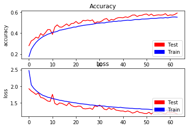
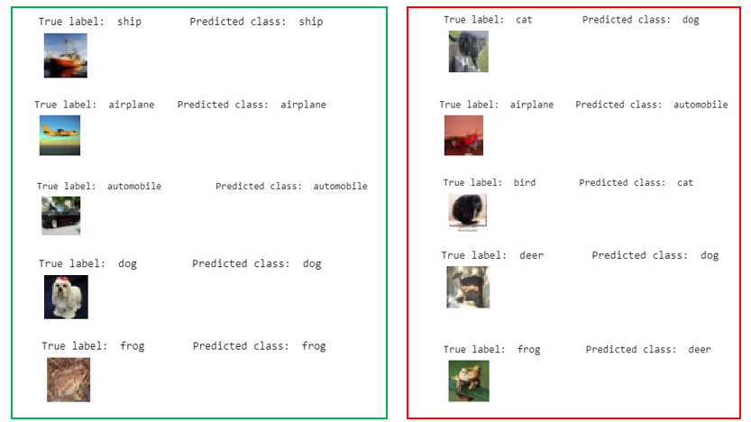

# First-steps-with-CNN: Classification-on-the-CIFAR-10-Dataset

## INTRODUCTION

Hello world, today I'm coming with my first repository on this plateform. The goal is to try a simple classification task with the CIFAR-10 Dataset in order to understand better how CNNs work. The CIFAR 10 Dataset is a set of 60 000 tiny images (32 x 32) coming from 10 various classes : airplane, automobile, bird, cat, deer, dog, frog, horse, ship and truck as we can see down there. So together, we'll try to develop a deep learning model able to classify a new image in the right class.

     

## PROJECT
This repository contains 2 main files: 

¤ CIFAR_10_Classification.ipynb which is a notebook that describes the whole process: how to collect data, how to preprocess those data and create a dataset, how to build, train and test our deep learning model.

¤ visual_callbacks.py which is a python file that contains the callbacks I used to display the loss and accuracy curves as well as the confusion matrix at the end of each epoch. This is a great tool to see how our CNN behaves with time.

I trained the model for more than 600 epochs. You will find the saved models [best_model.hdf5 and saved_model.hdf5] up there. Don't hesitate to download it and load the weights if needed.

## RESULTS
Our model has an accuracy of 0.76 the test set. This is not the best result in the world but it's a good start. 

At the beginning, the loss curve was smoothly going down while the accuracy curve was going up for both the training and test sets.

     

Later, the losses started oscillating a lot. (Don't mind the number of epochs here. I trained the model on google colab so I had to reload the model everytime the memory was full)

     

Here is the confusion matrix obtained at the end of the last epoch. Again, don't mind the number of epochs here. I trained the model on google colab so I had to reload the model everytime the memory was full

     

As we can see on the confusion matrix above, the model struggles when it comes to the cat class (54%). Some cat images are classified as dogs,frogs and sometimes horses or deers. Moreover, some dogs images are classified as cats and some bird images, as frogs, deers or dogs. However, the model works pretty well when it comes to the frog class(0.9), the truck class (0.88) or the automobile class.

Here is a visual showing the prediction performed by the trained model on some test images.

     

## IMPROVEMENT IDEAS
The results we obtained are more or less satisfying. Some classes are pretty well handled by the model while others are pretty tricky. The good news is that there is always room for improvement. So, to improve our model, we can try to play with the drop out and batchnormalization layers or to eventually add some more layers to the current.
